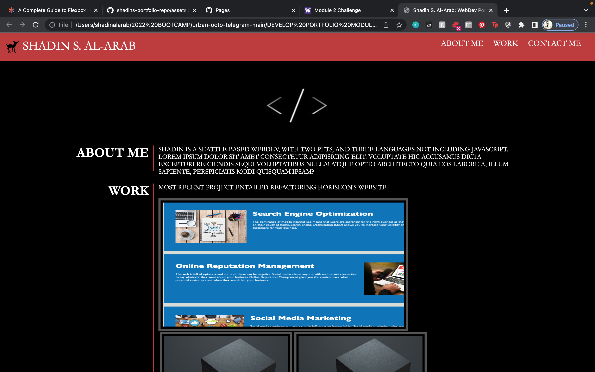

# shadins-portfolio-repo
In order to fulfill the requirements of this week's challenge, we were asked to create a portfolio for ourselves from the ground up.
As such, I provided a color palette, an avatar, and my latest completed work using my expirience as a WebDev.
My main concern with the responsiveness is the navigation bar adjusting after a width of 500px. This proved to be my biggest challenge in the media query section of my css.
mMst of my responsiveness concerns were solved by my use of flexboxes throughout. I initally wanted to use a icon to hide the navigation options after the screen width adjusted, 
however that is still above my pay grade as of now.
 
https://shadin-a.github.io/shadins-portfolio-repo/
 

